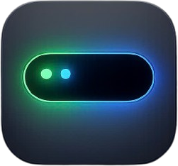

<p align="center">
  
</p>

<h1 align="center">Niche</h1>

<p align="center">A Dynamic Island for macOS — lives in your notch, shows what's playing, and more.</p>

<p align="center">
  <a href="https://github.com/SangNef/niche/releases/latest/download/Niche.zip">
    <strong>⬇️ Download the latest release</strong>
  </a>
</p>

## Features

- Pill anchored to the notch, flares to match the screen's top edge
- Hover to expand — shows now playing (Music, Spotify, browser tabs — anything that
  reports to macOS's system Now Playing info) with artwork, live progress bar, and
  play/pause/next/previous controls
- Volume and brightness HUD, styled to match the pill
- "Headphones connected" popup when an AirPods-style Bluetooth device connects, with
  battery percentage
- Launches at login, no Dock icon

## Installing

1. Download `Niche.zip` from [Releases](../../releases/latest), unzip it, and move
   `Niche.app` to `/Applications`.
2. First launch: right-click the app → **Open** (it isn't notarized, so Gatekeeper
   will otherwise refuse to open it) — or run:
   ```bash
   xattr -cr /Applications/Niche.app
   ```
3. Grant the Automation permission prompt when it appears (needed to read the
   currently playing track from Music/Spotify/browsers).

## Building from source

Requires Xcode Command Line Tools and [CMake](https://cmake.org) (`brew install cmake`).

```bash
git clone https://github.com/SangNef/niche.git
cd niche
./Scripts/build_app.sh
open Niche.app
```

The build script clones and compiles
[mediaremote-adapter](https://github.com/ungive/mediaremote-adapter) automatically —
it's what lets Niche read Now Playing info on macOS 15.4+, where Apple locked that
down for third-party apps.

For quick iteration during development, `swift build && swift run` works too, though
a few features (login item, notarization-dependent permission prompts) only behave
correctly from the packaged `.app`.

## Releasing a new version

```bash
./Scripts/build_app.sh
ditto -c -k --keepParent Niche.app Niche.zip
gh release create vX.Y.Z Niche.zip --title "Niche vX.Y.Z" --notes "..."
```

(Or upload `Niche.zip` manually via the GitHub web UI under **Releases → Draft a new
release**.) The download link at the top of this README always points at whatever
asset named `Niche.zip` is attached to the latest release — no need to update it
between releases.

## License

mediaremote-adapter is bundled under its own BSD 3-Clause license (see
`vendor/mediaremote-adapter/LICENSE` after building).
